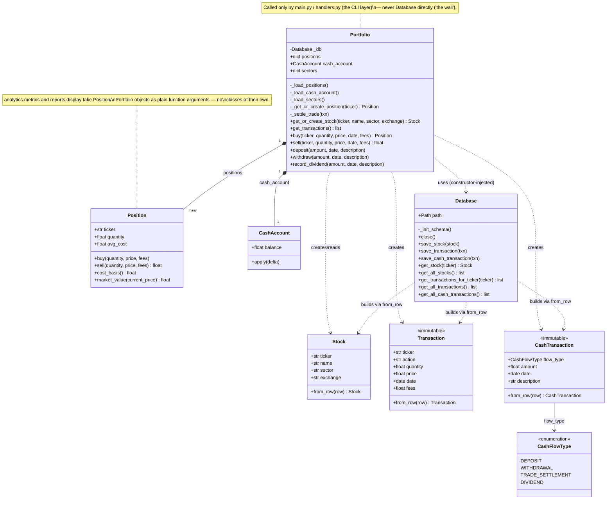

# UML Class Diagram

Covers the actual object model (`models/`, `db/`). `analytics/metrics.py`,
`reports/display.py`, `main.py`, and `handlers.py` are all plain functions,
not classes, so they're shown only as notes on the classes they call into,
not as class boxes of their own.

## Notes

- **Composition** (`*--`): `Portfolio` owns its `Position`s and its single
  `CashAccount` — they have no existence or lifecycle outside a `Portfolio`.
- **Dependency** (`..>`): `Portfolio` *uses* `Database` but doesn't own its
  lifecycle — `Database` is constructed in `main()` and injected into
  `Portfolio`'s constructor, and `main()` is also what closes it. This is the
  constructor-injection / resource-ownership split documented in the handoff
  notes, not composition.
- `positions`/`sectors` are `dict`s (`ticker -> Position` / `ticker -> sector`
  respectively); the "many" multiplicity on the `Position` relationship
  captures that rather than the field's raw type.
- Dunder methods (`__post_init__`, `__init__`) are omitted — they're either
  implicit in the attribute list or, for `Portfolio`/`Database`, pure
  construction/assembly with no return value worth modeling separately.
